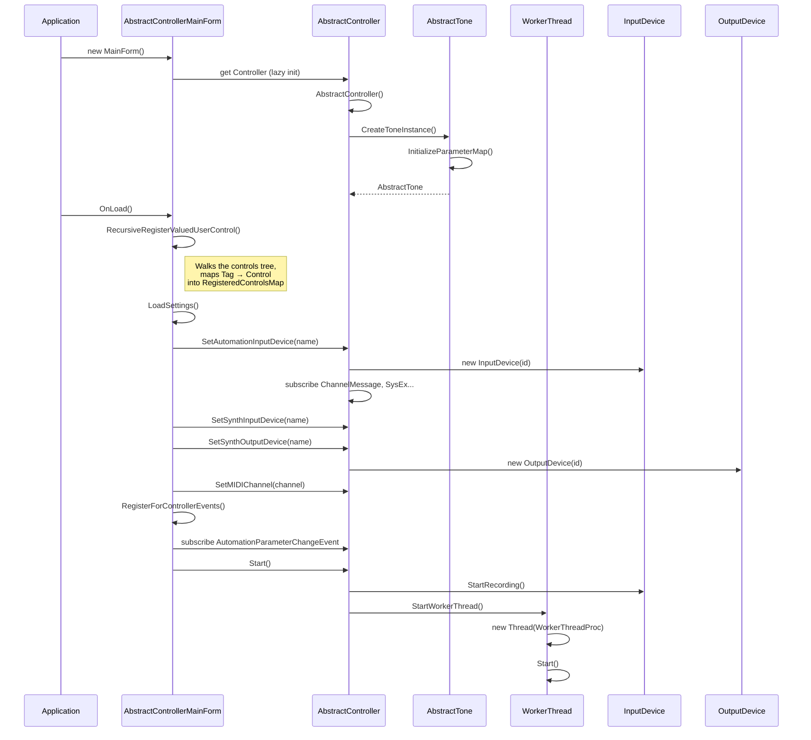
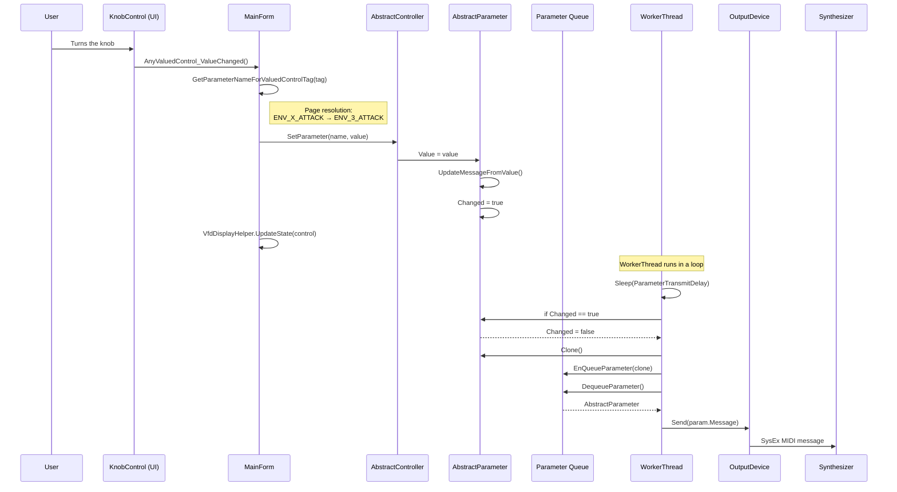
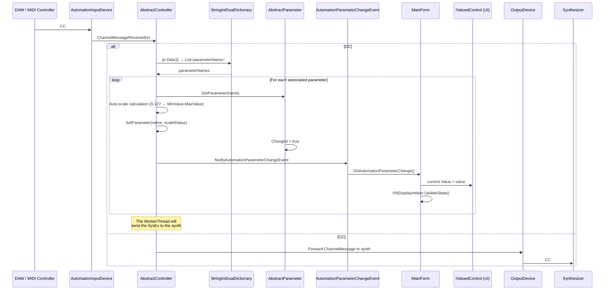
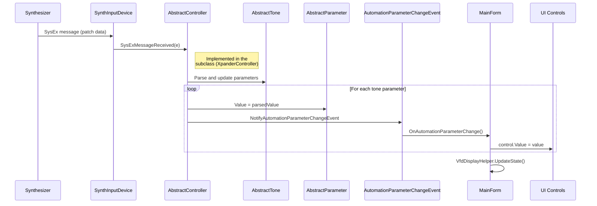
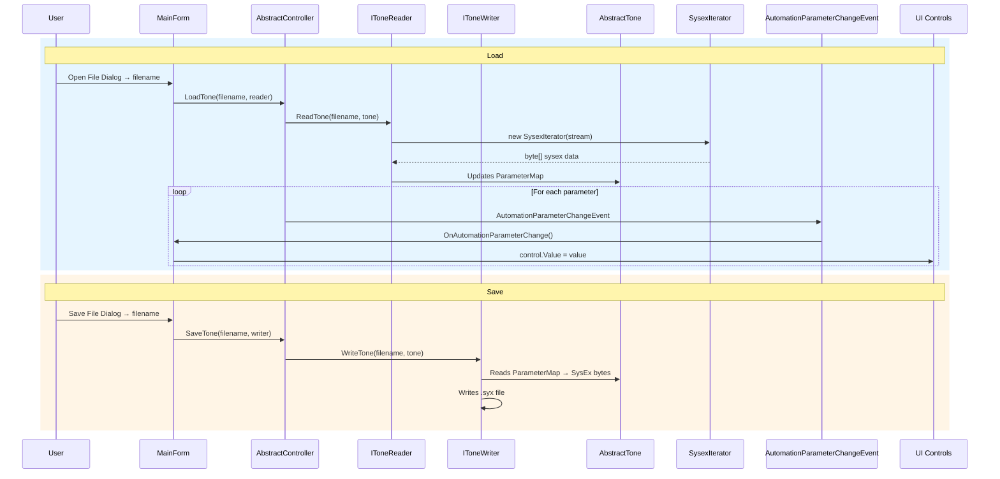
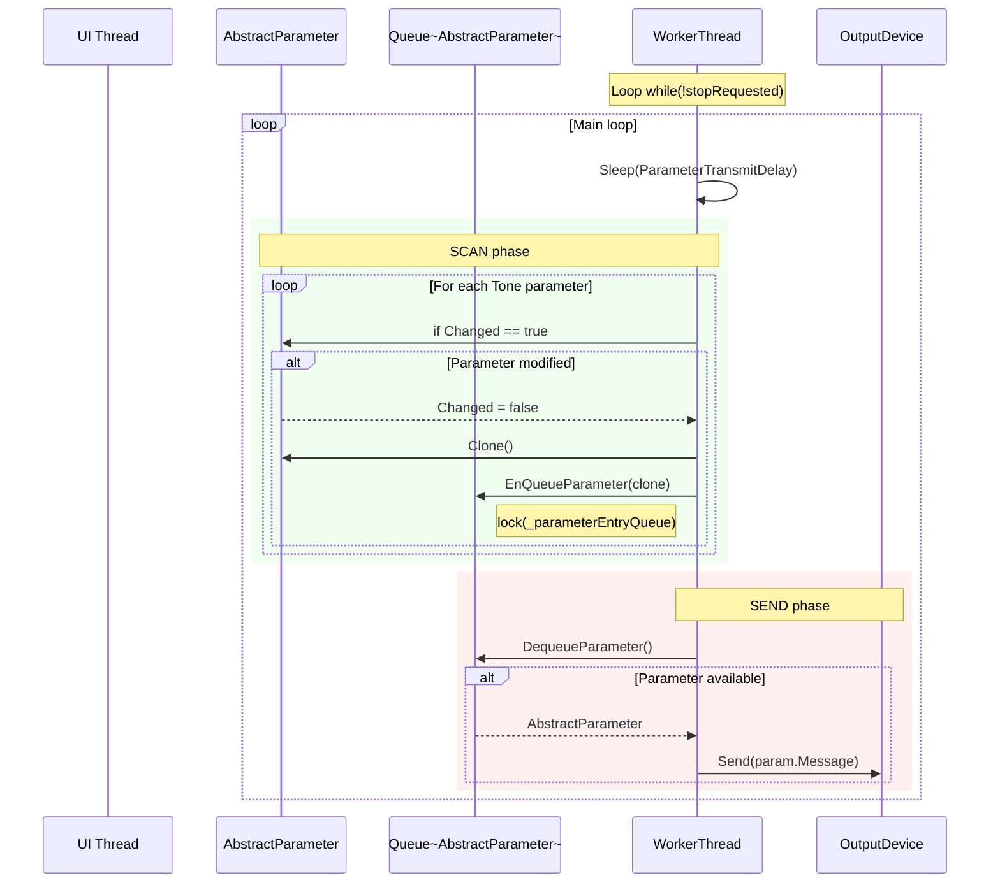
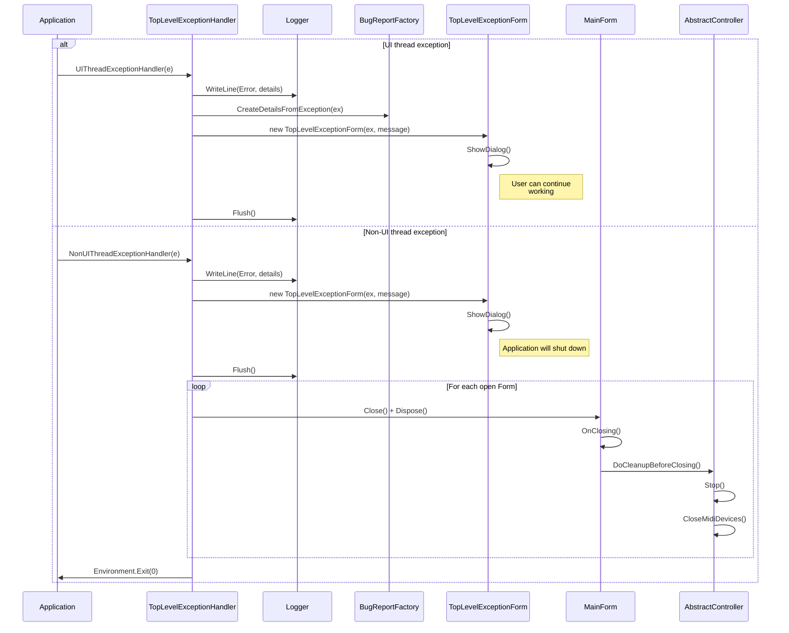
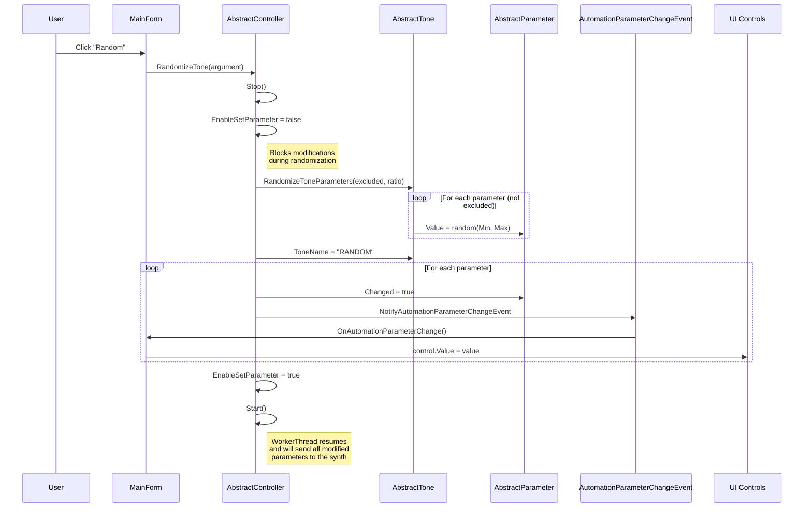
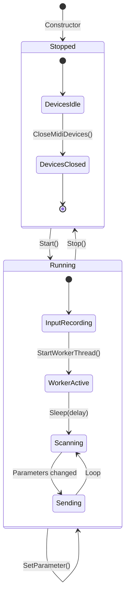
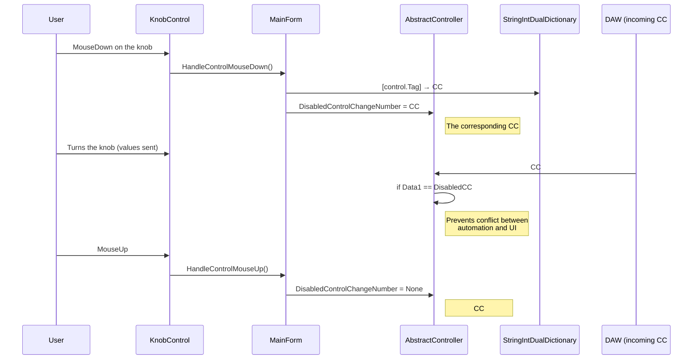

# MidiApp.MidiController — Dynamic Architecture

## Overview

This document describes the main dynamic flows of the `MidiApp.MidiController` framework: call sequences during startup, parameter modification, MIDI reception, persistence and error handling.

---

## 1. Application Startup

---

## 2. Parameter Change from the UI

This is the application's main flow: the user turns a knob, and the change is sent to the synthesizer.

---

## 3. Incoming MIDI CC# (DAW automation → synth)

---

## 4. SysEx Reception from the Synthesizer (patch dump)

---

## 5. Loading / Saving a SysEx File

---

## 6. WorkerThread Loop (Producer-Consumer)

---

## 7. Error Handling — Top Level Exception

---

## 8. Tone Randomization

---

## 9. Start / Stop Lifecycle

---

## 10. Temporary CC# Automation Disable Flow

---

## Thread Summary

| Thread | Responsibility | Synchronization Mechanism |
|---|---|---|
| **UI Thread** | Display, user events, MIDI reception (callbacks) | `SynchronizationContext.Post()` |
| **WorkerThread** | Scan modified parameters + send SysEx | `lock(_parameterEntryQueue)` |
| **MIDI Input Callbacks** | Asynchronous MIDI message reception | `lock(_controlChangeAutomationTable)` for `DisabledControlChangeNumber` |

## Thread-Safety Critical Points

- `AbstractParameter`: all properties are protected by `lock(_lockObject)`
- `StringIntDualDictionary`: all operations are protected by `lock(_lockObject)`
- `_parameterEntryQueue`: access protected by `lock` in `EnQueue` / `Dequeue`
- `_workerThreadStopRequested`: marked `volatile` for cross-thread visibility
- `DisabledControlChangeNumber`: protected by `lock(_controlChangeAutomationTable)`
