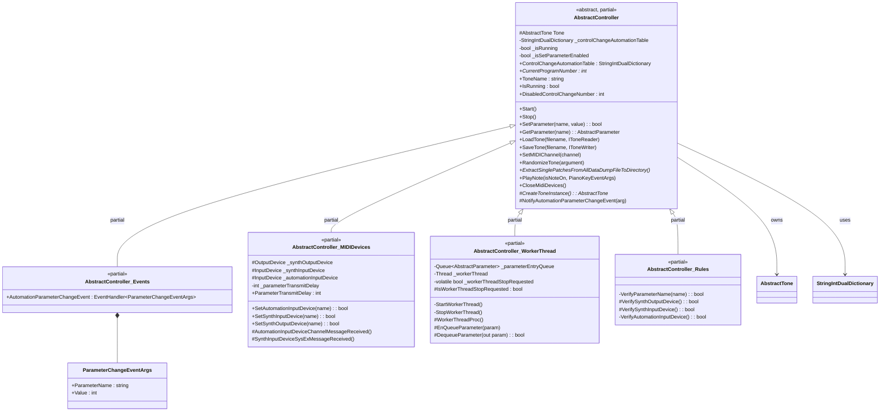
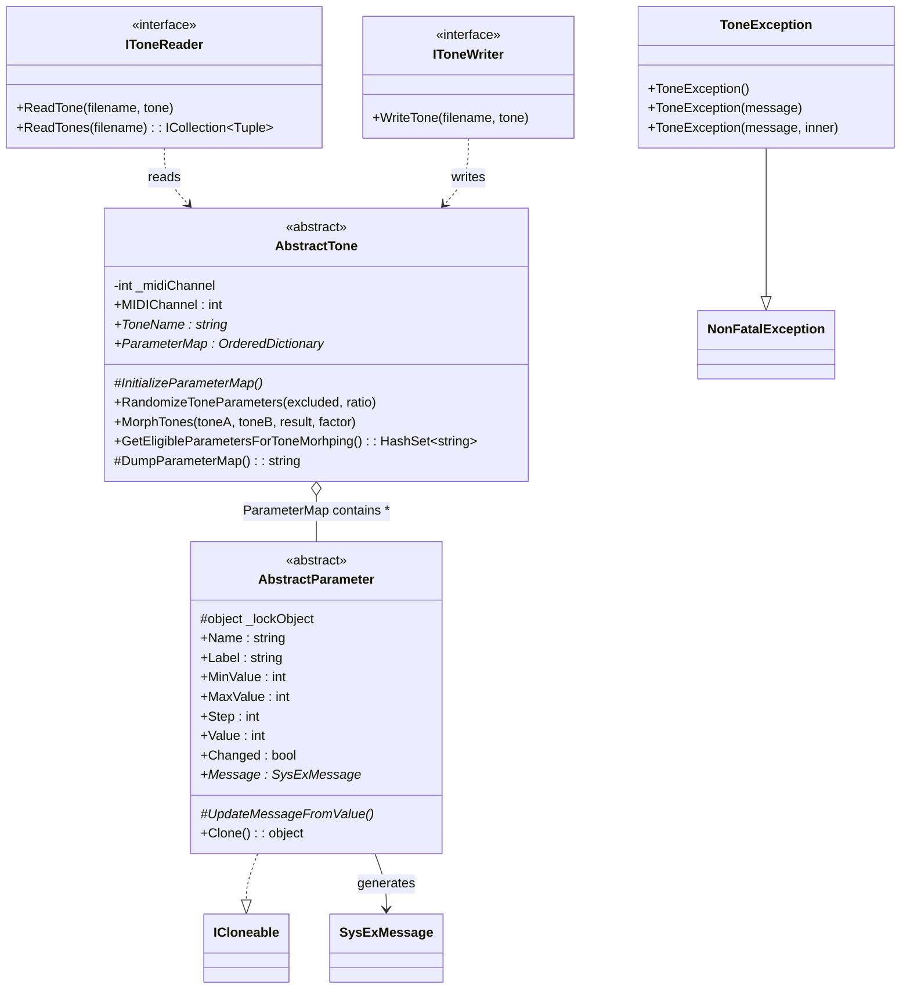
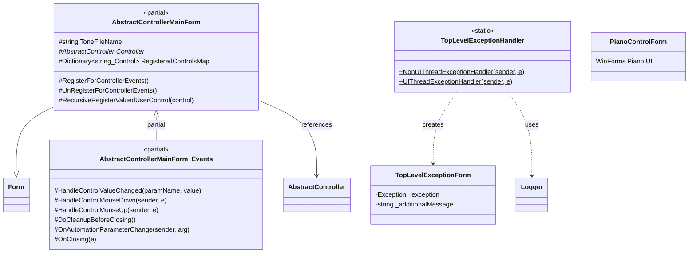
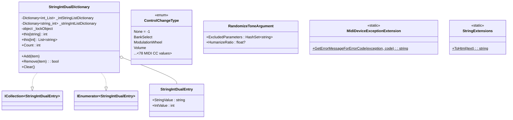
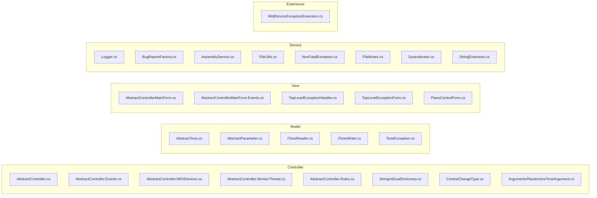
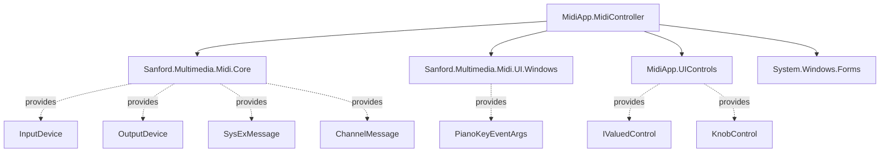

# MidiApp.MidiController — Static Architecture

## Overview

`MidiApp.MidiController` is a reusable **MVC** (Model-View-Controller) framework designed for building real-time MIDI synthesizer editors. It provides base abstractions for managing MIDI devices, tone parameters, persistence (SysEx file read/write) and the user interface.

The project is structured in **4 layers**: Controller, Model, View and Service.

---

## Main Class Diagram

---

## Model Layer

---

## View Layer

---

## Service Layer

```mermaid
classDiagram
    direction TB

    class Logger {
        <<static>>
        -TextWriterTraceListener _textWriterListener$
        -FileStream _filestream$
        +AutoFlush : bool$
        +Switch : TraceSwitch$
        +Write(message)$
        +WriteLine(message)$
        +Flush()$
    }

    class BugReportFactory {
        <<static>>
        +CreateBugReport(exception, message, ref errorId) : string$
        +CreateDetailsFromException(exception) : string$
        +CreateEnvironmentInfo() : string$
        +CreateMidiDevicesInfo() : string$
        +CreateScreensInfo(form) : string$
    }

    class AssemblyService {
        <<static>>
        +GetProductName() : string$
        +GetProductNameAndVersionAsString() : string$
        +GetVersionAsString() : string$
    }

    class FileUtils {
        <<static>>
        +SYSEX_FILE_EXTENSION : string$
        +SYSEX_FILE_EXTENSION_WITH_DOT : string$
        +SYSEX_FILE_FILTER : string$
        +MakeUniqueFilenameFromString(name, ext, dir) : string$
    }

    class NonFatalException {
        +NonFatalException()
        +NonFatalException(message)
        +NonFatalException(message, inner)
    }

    class FileMutex {
        -string _fileName
        -string _path
        -FileMutexState _fileMutexState
        +Lock()
        +Unlock()
        +Dispose()
    }

    class SysexIterator {
        -Stream _stream
        -byte[] _data
        -byte[] _current
        +Current : byte[]
        +MoveNext() : bool
        +Reset()
        +Dispose()
    }

    class ExecutionModeService {
        <<static>>
        +IsDesignModeActive : bool$
    }

    NonFatalException --|> Exception
    FileMutex ..|> IDisposable
    SysexIterator ..|> IEnumerator~byte[]~
    SysexIterator ..|> IEnumerable~byte[]~
```

---

## Controller Layer — Support

---

## File Organization by Layer

---

## External Dependencies

---

## Extension Points (abstract classes / interfaces)

| Element | Type | Role | Implemented by (Xplorer project) |
|---|---|---|---|
| `AbstractController` | `abstract class` | MIDI business logic | `XpanderController` |
| `AbstractTone` | `abstract class` | Tone data model | `XpanderTone` |
| `AbstractParameter` | `abstract class` | Individual SysEx parameter | `XpanderParameter` |
| `IToneReader` | `interface` | SysEx file reading | `XpanderToneReader` |
| `IToneWriter` | `interface` | SysEx file writing | `XpanderToneWriter` |
| `AbstractControllerMainForm` | `abstract class` | Editor main window | `MainForm` |
| `CreateToneInstance()` | `abstract method` | Tone factory method | Overridden in `XpanderController` |

---

## Design Patterns Used

| Pattern | Where | Description |
|---|---|---|
| **Template Method** | `AbstractController`, `AbstractTone` | Subclasses implement specific steps |
| **Observer** | `AutomationParameterChangeEvent` | Controller notifies the view of parameter changes |
| **Strategy** | `IToneReader` / `IToneWriter` | Reader/writer injection for persistence |
| **Producer-Consumer** | `WorkerThread` + `Queue<AbstractParameter>` | Thread-safe queue for SysEx transmission |
| **Partial Class** | `AbstractController` (5 files) | Separation of concerns by file |
| **Dual Dictionary** | `StringIntDualDictionary` | Bidirectional lookup CC# ↔ parameter |
| **Clone/Prototype** | `AbstractParameter.Clone()` | Parameter copy for asynchronous sending |
